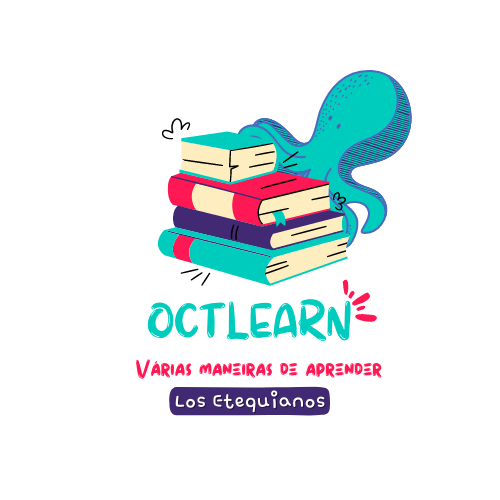

# Octlearn - Muitas maneiras de aprender 

Octlearn é um projeto voltado para a gamificação do ensino em sala de aula.

Por conta de diversos problemas encontrados no meio escolar nos dias atuais, como: desinteresse do aluno pelas aulas, ensino não diversificado e com sua qualidade reduzida, desenvolvemos uma solução tecnológica voltada para resolução e diminuição desses problemas "Octlearn - Muitas maneiras de aprender". 
Este projeto é voltado exclusivamente para as instituições de ensino que abrangem o ciclo fundamental II e respectivamente para seus alunos e docentes. 
Nosso objetivo é tornar esse projeto, que é um aplicativo, uma ferramenta útil para os professores e algo que complementa o ensino do aluno em sala de aula, trazendo jogos, quizzes, referências, seu desempenho e organização das matérias e conteúdos vistos em sala de aula. Acreditamos que, trazer um ensino que mostre uma visão diferente e que aproveite melhor todos os métodos de aplicação de conteúdos e matérias é algo que enriquece na vida acadêmica do aluno, pois traz interesse, vontade de aprender, e por meios diversificados, pode ajudá-lo em sua construção do seu projeto de vida.

